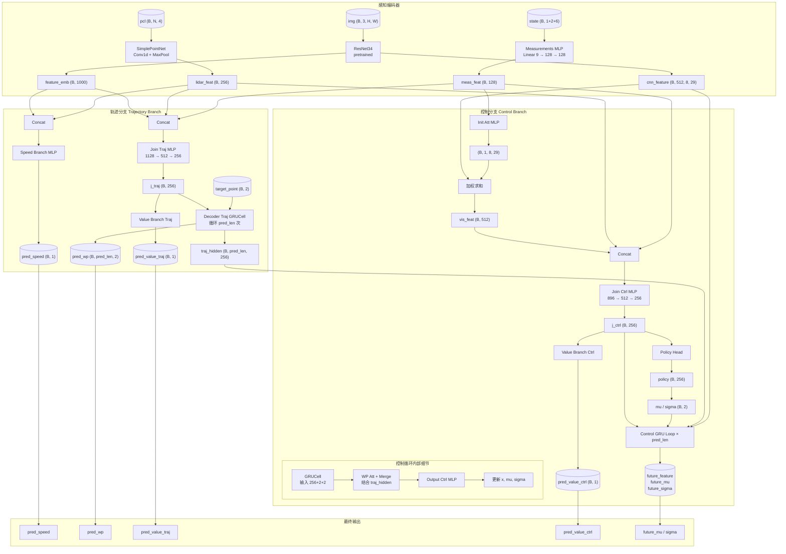

# Model Structure

```mermaid
flowchart TD
    %% 输入
    img[("img (B, 3, H, W)")]
    pcl[("pcl (B, N, 4)")]
    state[("state (B, 1+2+6)")]
    target[("target_point (B, 2)")]

    %% 感知编码器
    subgraph Perception_Encoders [感知编码器]
        resnet[ResNet34<br>pretrained]
        pointnet[SimplePointNet<br>Conv1d + MaxPool]
        meas_mlp[Measurements MLP<br>Linear 9 → 128 → 128]

        img --> resnet
        pcl --> pointnet
        state --> meas_mlp

        resnet --> feat_emb["feature_emb (B, 1000)"]
        resnet --> cnn_feat["cnn_feature (B, 512, 8, 29)"]
        pointnet --> lidar_feat["lidar_feat (B, 256)"]
        meas_mlp --> meas_feat["meas_feat (B, 128)"]
    end

    %% 轨迹分支
    subgraph Trajectory_Branch [轨迹分支 Trajectory Branch]
        concat_speed[Concat] --> speed_branch[Speed Branch MLP] --> pred_speed[("pred_speed (B, 1)")]
        concat_traj[Concat] --> join_traj[Join Traj MLP<br>1128 → 512 → 256] --> j_traj["j_traj (B, 256)"]
        
        feat_emb & lidar_feat --> concat_speed
        feat_emb & lidar_feat & meas_feat --> concat_traj

        j_traj --> value_traj[Value Branch Traj] --> pred_val_traj[("pred_value_traj (B, 1)")]
        
        j_traj & target --> traj_gru[Decoder Traj GRUCell<br>循环 pred_len 次] --> pred_wp[("pred_wp (B, pred_len, 2)")]
        traj_gru --> traj_hidden["traj_hidden (B, pred_len, 256)"]
    end

    %% 控制分支
    subgraph Control_Branch [控制分支 Control Branch]
        meas_feat --> init_att[Init Att MLP] --> att_weights1["(B, 1, 8, 29)"]
        cnn_feat & att_weights1 --> weighted_sum1[加权求和] --> vis_feat["vis_feat (B, 512)"]

        concat_ctrl[Concat] --> join_ctrl[Join Ctrl MLP<br>896 → 512 → 256] --> j_ctrl["j_ctrl (B, 256)"]
        vis_feat & lidar_feat & meas_feat --> concat_ctrl

        j_ctrl --> value_ctrl[Value Branch Ctrl] --> pred_val_ctrl[("pred_value_ctrl (B, 1)")]
        j_ctrl --> policy_head[Policy Head] --> init_policy["policy (B, 256)"]
        init_policy --> init_mu_sigma["mu / sigma (B, 2)"]

        j_ctrl & init_mu_sigma & traj_hidden & cnn_feat --> ctrl_loop[Control GRU Loop × pred_len]
        
        subgraph Loop_Detail [控制循环内部细节]
            ctrl_gru[GRUCell<br>输入 256+2+2] --> wp_att[WP Att + Merge<br>结合 traj_hidden] --> out_ctrl[Output Ctrl MLP] --> update_state[更新 x, mu, sigma]
        end
        
        ctrl_loop --> future_out[("future_feature<br>future_mu<br>future_sigma")]
    end

    %% 输出汇总
    subgraph Outputs [最终输出]
        O1[pred_speed]
        O2[pred_wp]
        O3[pred_value_traj]
        O4[pred_value_ctrl]
        O5[future_mu / sigma]
    end

    pred_speed --> O1
    pred_wp --> O2
    pred_val_traj --> O3
    pred_val_ctrl --> O4
    future_out --> O5
```
